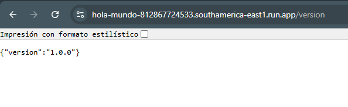

Instrucciones de configuración:
1-Requisitos previos
- Tener una cuenta en GitHub
- Tener una cuenta Docker Hub
- Tener una cuenta en algun Cloud, en mi caso GCP con un proyecto habilitado
- Tener instalado Git, docker, y Google Cloud SDK localmente
- Habilitar la API de Cloud Run en GCP. (gcloud services enable run.googleapis.com)
- Configurar la facturación en GCP para poder usar Cloud Run
- El usuario de servicio del proyecto debe estar configurado con los privilegios de propietario o administrador, de lo contrario no se podrá hacer público el servicio al momento de deploy. https://cloud.google.com/run/docs/authenticating/public?hl=es-419#yaml

2-Clonar el repositorio
- Hacer un fork al repositorio sugerido 
- Clonar el repositorio a tu entorno local y levantar el contenedor en el puerto 80
git clone https://github.com/bryandj29/getting-started.git
docker run -dp 80:80 docker/getting-started

3-Configurar los Secrets en GitHub
- Ir a Settings/Secrets and variables/Actions/New repository secrets
- Se agregaron las siguentes variables secretas con sus respectivos valores
DOCKERHUB_PASSWORD / mi usuario de docker hub
DOCKERHUB_USERNAME / mi contraseña de docker hub
GCP_PROJECT_ID / ID del proyecto
GCP_REGION / Region donde se desplegara el servicio (en mi caso southamerica-east1)
GOOGLE_CREDENTIALS / clave JSON de la cuenta de servicio de GCP

4-Ejecutar el pipeline CI/CD
- Hacer push de los cambios de la rama principal
git add. 
git commit -m "comentario"
git push origin maim

- Esto activará el pipeline en Github Actions el cual: 
  - Construira la imagen Docker y la subira a DockerHub
  - Desplegara el contenedor en GCP
  - Configurará la invocacion sin autenticación

5-Verificar el deploy de la App
- Ir a la consola de Google Cloud Run
- Busca el servicio desplegado y copiar la URL publica para probar la App
- Tambien se puede hacer desde la temrinal con el siguiente comando "gcloud run services describe hola-mundo --region=southamerica-east1 --format='value(status.url)'"

6-Como valor agregado se creo una variable de entorno llamda VERSION la cual nos muestra la version de la App si agregamos /version al final de la url.
https://hola-mundo-812867724533.southamerica-east1.run.app/version

Descripción de enfoque de conteinerización
1-Creación del Dockerfile
- Lo primero fue armar una aplicación simple con python app.py para ejecutarla en flask, la misma mandaba el msj Hola mundo, soy "mi nombre y apellidos". 
- Luego se configuro para que saliera por le puerto 8080 ya que el puerto por defecto que usa flask es el 5000.
- Se uso la imagen base python:alpine3.21
- Se copió la app.py dentro del contendor se compiló con "docker build -t miusuario/newapp:vx" y se probó localmente.
- Se subió a Dockerhub con "docker push miusuario/newapp:v2"

Detalles del pipeline CI/CD
1-El pipeline de CI/CD fue configurado en GitHub Actions para automatizar la construcción y despliegue de la aplicación. Se compone de los siguientes pasos:
- El trigger del pipeline se activa automáticamente al hacer un push a la rama main.

2-Construcción y publicación del contenedor:
- Se autentica en Docker Hub.
- Se construye la imagen con docker build.
- Se sube la imagen a Docker Hub.

3-Autenticación en Google Cloud:
- Se usa "google-github-actions/auth" para autenticarse en GCP usando una cuenta de servicio.

4-Despliegue en Google Cloud Run:
- Se usa "gcloud run deploy" para desplegar el servicio con la imagen actualizada.
- Se configura --allow-unauthenticated para permitir acceso sin autenticación.

El resultado es un flujo automatizado en el que, al hacer cambios en el código y hacer un push, se genera una nueva imagen, se sube a Docker Hub y se despliega automáticamente en Google Cloud Run.

URL de la aplicación:
https://hola-mundo-812867724533.southamerica-east1.run.app
https://hola-mundo-812867724533.southamerica-east1.run.app/version

Desafío que enfrete:
1-El primer desafío que enfreté fue tener que decidir que nube usar ya que las sugeridas no las domino y termine eligiendo al proveedor mas conocido GCP, esto conllevó a que por mi corta o casi nula experiencia en esa nube pase mas tiempo investigando como hacer las cosa que haciendolas.
2-El segundo desafío importante fue desplegar la app como servicio web de acceso público, luego de desplegar varias veces la app con distintos valores el resultado siempre era el mismo. Hasta que a ultima hora del jueves pude encontrar un documento que explicaba que el usuario que despliega una app en Cloud Run debe ser Administrador o Propietario para poder darle los permisos de acceso público sin autorización.
3-Desafío poder terminar de documentar todo para tenerlo listo y entregarlo el viernes a primera hora.

Sugerencias para mejorar este despliegue para un entorno de producción:
1-Configurar autenticación en Google Cloud Run en lugar de permitir acceso público (--allow-unauthenticated).
2-Eliminar archivos innecesarios con .dockerignore
3-Excluir archivos innecesarios o sensibles con .gitignore
4-Definir una estrategia de escalado con min-instances para mejorar tiempos de respuesta
5-Agregar pruebas automatizadas con pytest por ejm.
6-Usar Secret Manager en GCP para almacenar credenciales y claves API en lugar de pasarlas como variables de entorno.
7-Considerar Cloud Build en lugar de GitHub Actions se se busca mayor integración con GCP reducción de costos en pipelines.